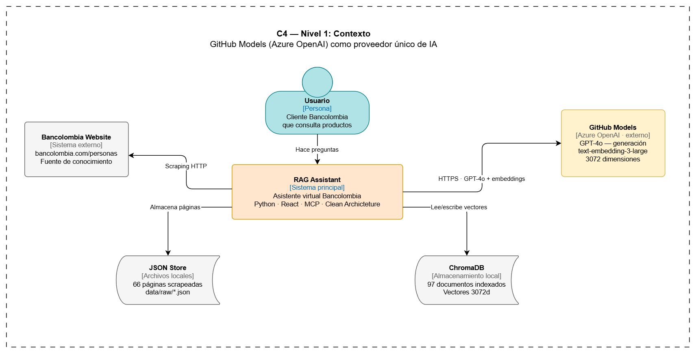
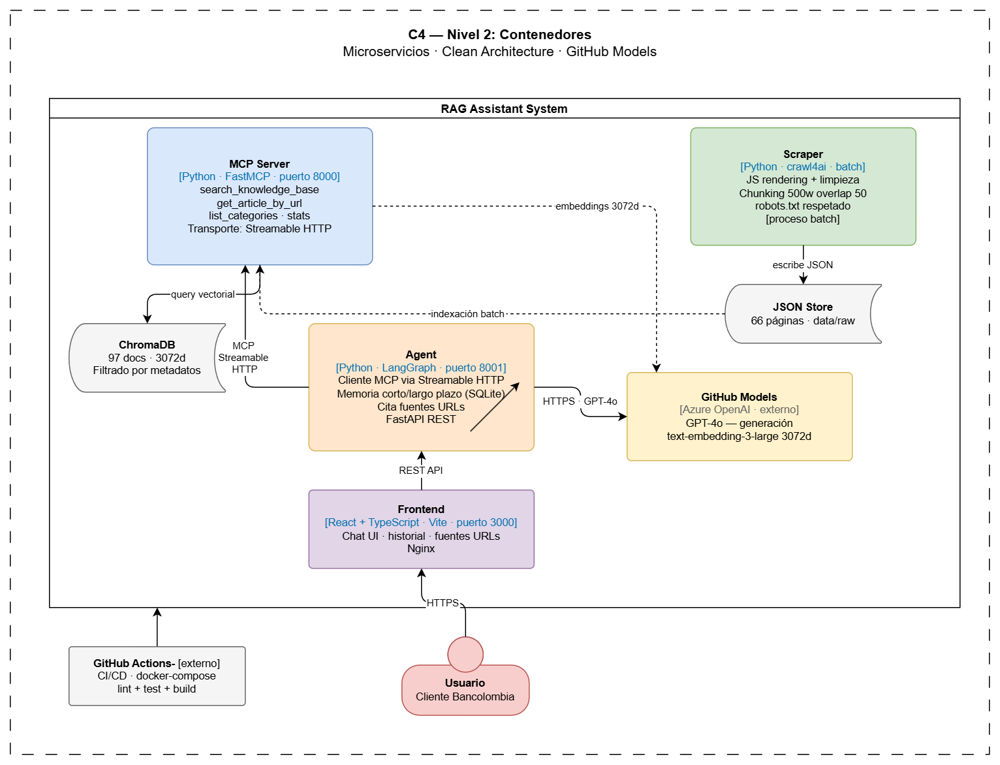
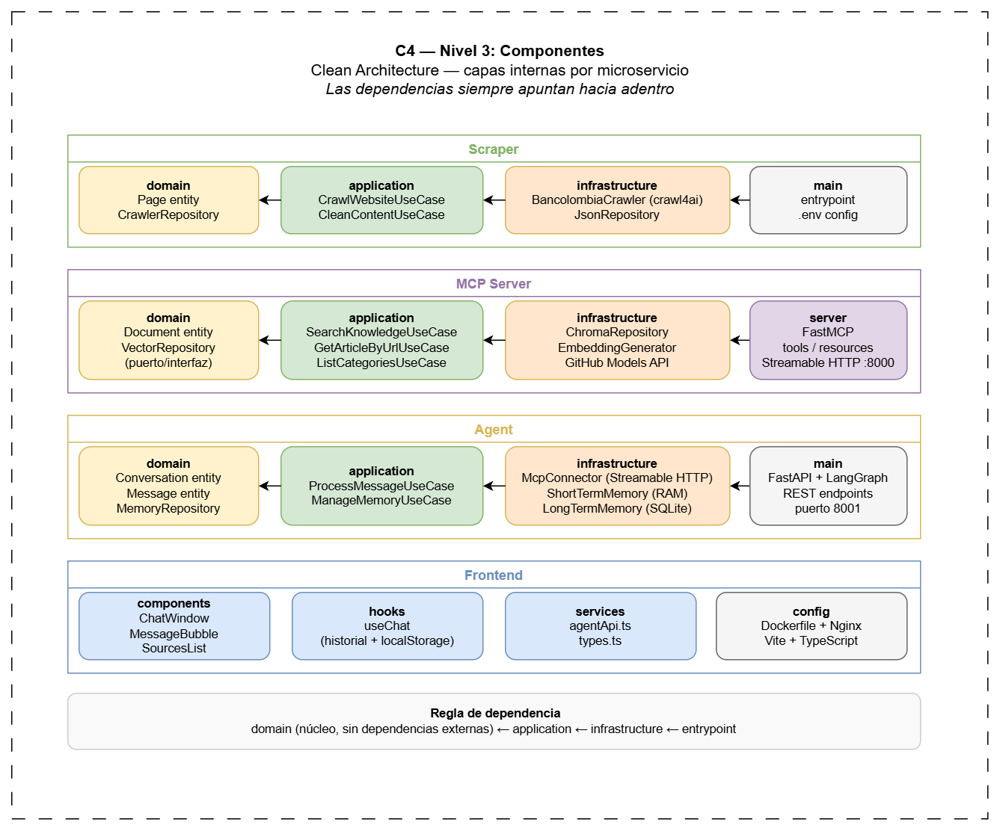

# RAG Assistant


Asistente virtual del Grupo Bancolombia que responda preguntas sobre productos, servicios y contenido publicado en la sección de personas del sitio web,utilizando una arquitectura RAG con un agente conversacional accesible mediante unainterfaz de chat.

---

## Arquitectura

### C4 Nivel 1 — Contexto


### C4 Nivel 2 — Contenedores


### C4 Nivel 3 — Componentes (Clean Architecture)


---

## Microservicios

| Servicio | Tecnología | Puerto | Descripción |
|---|---|---|---|
| **Scraper** | Python · crawl4ai | batch | Crawling y procesamiento de bancolombia.com/personas |
| **MCP Server** | Python · FastMCP | 8000 | Servidor MCP con tools RAG y base vectorial |
| **Agent** | Python · LangGraph | 8001 | Agente conversacional cliente MCP |
| **Frontend** | React · TypeScript | 3000 | Interfaz de chat con historial y fuentes |

---
## Memoria del Agente — 3 niveles

El agente implementa una arquitectura de memoria en 3 niveles para mantener contexto conversacional:

| Tipo | Implementación | Persistencia | Alcance |
|---|---|---|---|
| **Corto plazo** | MemorySaver LangGraph (RAM) | Solo sesión activa | Mensajes del turno actual por `thread_id` |
| **Mediano plazo** | Resúmenes en SQLite | Entre sesiones | Contexto resumido de conversaciones anteriores — se genera automáticamente cuando una conversación supera 10 mensajes |
| **Largo plazo** | SQLite via SQLAlchemy | Permanente | Historial completo de todas las conversaciones persistido en disco |

### Justificación
- **Corto plazo** — LangGraph `MemorySaver` mantiene el hilo de la conversación activa sin overhead de base de datos
- **Mediano plazo** — Los resúmenes permiten al agente recordar conversaciones anteriores sin cargar todo el historial
- **Largo plazo** — SQLite dockerizable con volúmenes — migrable a PostgreSQL para producción sin cambiar el dominio (`MemoryRepository` es una interfaz)

### Memoria del Frontend
Adicionalmente el frontend implementa persistencia del historial de conversaciones en **localStorage** del navegador:
- Máximo 20 conversaciones guardadas
- Cada conversación incluye mensajes, fuentes y metadatos
- Persiste entre reinicios del navegador
- El usuario puede navegar entre conversaciones anteriores desde el sidebar
- Se limpia con el botón "Nueva conversación"

> **Nota:** Esta capa es complementaria a la memoria del agente — el frontend guarda el historial visual mientras el agente mantiene el contexto conversacional en SQLite.
---

## Stack tecnológico

| Componente | Tecnología | Justificación |
|---|---|---|
| Web Scraping | crawl4ai + playwright | Renderizado JavaScript nativo |
| Limpieza | trafilatura | Extrae solo contenido relevante |
| Embeddings | text-embedding-3-large (GitHub Models) | 3072d, multilingüe, supera sentence-transformers en MTEB |
| Base vectorial | ChromaDB | Local, sin costo, dockerizable, migrable a Qdrant/Pinecone |
| LLM | GPT-4o (GitHub Models / Azure OpenAI) | 128k contexto, razonamiento financiero en español |
| MCP Transport | Streamable HTTP | Permite múltiples clientes simultáneos vs stdio |
| Agente | LangGraph | Grafos de estado, memoria estructurada, tool orchestration |
| Frontend | React + TypeScript + Vite | Moderno, tipado, rápido |
| CI/CD | GitHub Actions | Lint + test + docker build en cada push |


---

---

## Instalación y ejecución

### Prerrequisitos
- Python 3.11+
- Node.js 22+
- Docker Desktop
- uv (`pip install uv`)
- Token de GitHub con acceso a GitHub Models

### Variables de entorno

Copia los `.env.example` de cada microservicio:
```bash
cp scraper/.env.example scraper/.env
cp mcp-server/.env.example mcp-server/.env
cp agent/.env.example agent/.env
```

### 🔐 Configuración del archivo .env para autenticación
Para habilitar el acceso a los modelos de GitHub, debes agregar tu `GITHUB_TOKEN` en `mcp-server/.env` y `agent/.env`.

🔑 Genera tu token personal en el siguiente enlace: 
[Playground de GitHub Models](https://github.com/marketplace/models/azure-openai/gpt-4o/playground)

🖼️ Ejemplo visual:


```
GITHUB_TOKEN="[tu-github-token]"
```

### Opción 1 — Docker (recomendado)
```bash
docker-compose up --build
```

Servicios disponibles:
- Frontend: http://localhost:3000
- Agent API: http://localhost:8001/docs
- MCP Server: http://localhost:8000/mcp

### Opción 2 — Ejecución local

**1. Scraper** (solo primera vez):
```bash
cd scraper
uv venv && .venv/Scripts/activate
uv sync
python src/main.py
```

**2. Indexar embeddings** (solo primera vez):
```bash
cd mcp-server
uv venv && .venv/Scripts/activate
uv sync
python src/indexer.py
```

**3. MCP Server:**
```bash
python src/server.py
```

**4. Agent** (nueva terminal):
```bash
cd agent
uv venv && .venv/Scripts/activate
uv sync
python src/main.py
```

**5. Frontend** (nueva terminal):
```bash
cd frontend
npm install
npm run dev
```

---

## Tests
```bash
# Scraper
cd scraper && uv run pytest tests/ -v

# MCP Server
cd mcp-server && uv run pytest tests/ -v

# Agent
cd agent && uv run pytest tests/ -v
```

**Resultado:** 16 tests pasando ✅


## MCP Inspector — Pruebas locales

### Streamable HTTP (producción)
Con el servidor MCP corriendo:
```bash
cd mcp-server
python src/server.py
```

En el inspector:
- **Transport Type:** `Streamable HTTP`
- **URL:** `http://localhost:8000/mcp`
- **Connection Type:** `Via Proxy`

### STDIO (pruebas locales)
Sin servidor corriendo previamente:

En el inspector:
- **Transport Type:** `STDIO`
- **Command:** `C:\Prueba_tecnica\rag-assistant\mcp-server\.venv\Scripts\python.exe`
- **Arguments:** `C:\Prueba_tecnica\rag-assistant\mcp-server\run_stdio.py`

El script `run_stdio.py` carga automáticamente el `.env` y fuerza el transporte stdio.
---

## CI/CD

### Pipeline CI (GitHub Actions)
Se ejecuta automáticamente en cada push a `main`:
-  Lint y tests de scraper, mcp-server y agent
-  Build del frontend
-  Build de imágenes Docker

### Pipeline CD (documentado)
Para despliegue en producción se recomienda:

1. **Build y push de imágenes:**
```bash
docker build -t ghcr.io/leor22/bancolombia-mcp-server ./mcp-server
docker build -t ghcr.io/leor22/bancolombia-agent ./agent
docker build -t ghcr.io/leor22/bancolombia-frontend ./frontend
docker push ghcr.io/leor22/bancolombia-mcp-server
docker push ghcr.io/leor22/bancolombia-agent
docker push ghcr.io/leor22/bancolombia-frontend
```

2. **Despliegue en servidor:**
```bash
docker-compose pull
docker-compose up -d
```

Para automatizar el CD, agregar a `.github/workflows/cd.yml` con secrets
`GITHUB_TOKEN` y `SERVER_SSH_KEY`.

---

## Estructura del proyecto
```
rag-assistant/
├── scraper/                    # Microservicio de crawling
│   ├── src/
│   │   ├── domain/            # Entidades y repositorios
│   │   ├── application/       # Casos de uso
│   │   └── infrastructure/    # crawl4ai, JSON persistence
│   └── Dockerfile
├── mcp-server/                 # Servidor MCP + RAG
│   ├── src/
│   │   ├── domain/
│   │   ├── application/       # search, get_article, list_categories
│   │   └── infrastructure/    # ChromaDB, GitHub Models embeddings
│   └── Dockerfile
├── agent/                      # Agente LangGraph
│   ├── src/
│   │   ├── domain/
│   │   ├── application/
│   │   └── infrastructure/    # MCP client, SQLite memory
│   └── Dockerfile
├── frontend/                   # React + TypeScript
│   ├── src/
│   │   ├── components/
│   │   ├── hooks/
│   │   └── services/
│   └── Dockerfile
├── docs/
│   └── architecture/          # Diagramas C4
│   └── decisions/             # Desiciones técnicas
├── docker-compose.yml
└── .github/workflows/ci.yml
```

---

## Limitaciones conocidas

- El scraper puede no acceder a páginas con protección antibot avanzada de Bancolombia
- ChromaDB local no escala horizontalmente — para producción migrar a Qdrant o Pinecone
- GitHub Models tiene rate limits en el tier gratuito — puede ralentizar indexaciones grandes
- El historial de conversación se almacena en localStorage del navegador (máx. 20 conversaciones)

---

## Licencia

Este proyecto está licenciado bajo la Licencia MIT. Consulta el archivo LICENSE para más detalles.

## Contacto

- Leandro Rivera: <leo.232rivera@gmail.com>
- Linkedin: <https://www.linkedin.com/in/leandrorivera/>

### ¡Feliz Codificación! 🚀

Si encuentras útil este proyecto, ¡dale una ⭐ en GitHub! 😊
