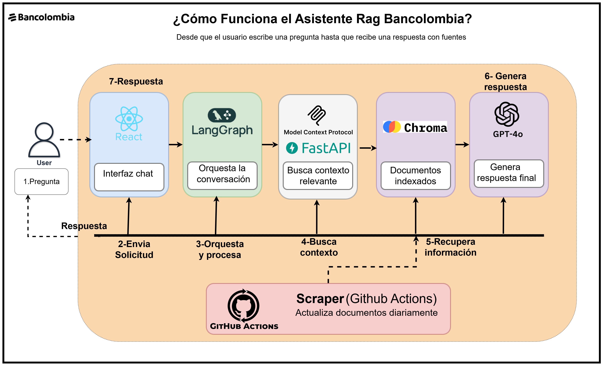
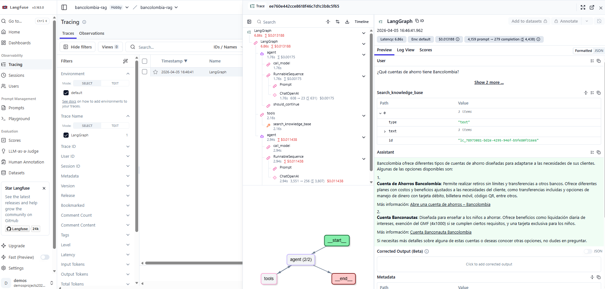

# RAG Assistant — Bancolombia Virtual Assistant


Asistente virtual del Grupo Bancolombia que responde preguntas sobre productos, servicios y contenido publicado en la sección de personas del sitio web, utilizando una arquitectura RAG con un agente conversacional accesible mediante una interfaz de chat.

---

## Nota para el evaluador

> La solución usa exclusivamente servicios gratuitos:
> - **Groq** — LLM inference con GPT OSS 20B, 14,400 requests/día, compatible con API OpenAI
> - **GitHub Models** (Azure OpenAI) — gratuito con token de GitHub, usado para embeddings
> - **ChromaDB** — base vectorial local, sin costo
> - **Railway** — tier gratuito para los 3 microservicios
> - **GitHub Actions** — CI/CD gratuito para repositorios públicos
>
> El sistema está diseñado para ser agnóstico al proveedor de LLM. Cambiar a Azure OpenAI, AWS Bedrock o Google Vertex AI requiere solo modificar 2 variables de entorno sin tocar el código.

### Opciones de ejecución

| Opción | Descripción | Requisitos |
|---|---|---|
| **Sistema en producción** | Sistema desplegado en Railway | Solo abrir el link |
| **Docker local** | `docker-compose up --build` | Docker Desktop + tokens |
| **Local manual** | Ejecutar cada servicio por separado | Python 3.11 + Node.js 22 |

**URLs del sistema en producción:**
- Frontend: https://frontend-production-1bed.up.railway.app
- Agent API Docs: https://agent-production-065e.up.railway.app/docs
- MCP Server: https://rag-assistant-production-bb17.up.railway.app/mcp

---

## Flujo de una consulta



---

## Arquitectura

### C4 Nivel 1 — Contexto


### C4 Nivel 2 — Contenedores


### C4 Nivel 3 — Componentes (Clean Architecture)


---

## Microservicios

| Servicio | Tecnología | Puerto | Descripción |
|---|---|---|---|
| **Scraper** | Python · crawl4ai | batch | Crawling y procesamiento de bancolombia.com/personas |
| **MCP Server** | Python · FastMCP | 8000 | Servidor MCP con tools RAG y base vectorial |
| **Agent** | Python · LangGraph | 8001 | Agente conversacional cliente MCP |
| **Frontend** | React · TypeScript | 3000 | Interfaz de chat con historial y fuentes |

---

## Memoria del Agente — 3 niveles

El agente implementa una arquitectura de memoria en 3 niveles para mantener contexto conversacional:

| Tipo | Implementación | Persistencia | Alcance |
|---|---|---|---|
| **Corto plazo** | MemorySaver LangGraph (RAM) | Solo sesión activa | Mensajes del turno actual por `thread_id` |
| **Mediano plazo** | Resúmenes en SQLite | Entre sesiones | Contexto resumido — se genera automáticamente cuando una conversación supera 10 mensajes |
| **Largo plazo** | SQLite via SQLAlchemy | Permanente | Historial completo de todas las conversaciones persistido en disco |

### Justificación
- **Corto plazo** — LangGraph `MemorySaver` mantiene el hilo de la conversación activa sin overhead de base de datos
- **Mediano plazo** — Los resúmenes permiten al agente recordar conversaciones anteriores sin cargar todo el historial
- **Largo plazo** — SQLite dockerizable con volúmenes — migrable a PostgreSQL para producción sin cambiar el dominio (`MemoryRepository` es una interfaz)

### Memoria del Frontend
El frontend implementa persistencia del historial en **localStorage** del navegador:
- Máximo 20 conversaciones guardadas
- Cada conversación incluye mensajes, fuentes y metadatos
- Persiste entre reinicios del navegador
- El usuario puede navegar entre conversaciones anteriores desde el sidebar

---

## Stack tecnológico

| Componente | Tecnología | Justificación |
|---|---|---|
| Web Scraping | crawl4ai + playwright | Renderizado JavaScript nativo |
| Limpieza | trafilatura | Extrae solo contenido relevante |
| Embeddings | text-embedding-3-large (GitHub Models) | 3072d, multilingüe, supera sentence-transformers en MTEB |
| Base vectorial | ChromaDB | Local, sin costo, dockerizable, migrable a Qdrant/Pinecone |
| LLM | GPT OSS 20B (Groq) | 1000 T/seg, function calling estable, 131k contexto, 14,400 req/día gratis |
| MCP Transport | Streamable HTTP + stdio | Producción y pruebas locales |
| Agente | LangGraph | Grafos de estado, memoria estructurada, tool orchestration |
| Frontend | React + TypeScript + Vite | Moderno, tipado, rápido |
| Observabilidad | Langfuse | Trazabilidad completa de interacciones LLM |
| CI/CD | GitHub Actions | Lint + test + docker build en cada push |
| Despliegue | Railway | Tier gratuito, auto-deploy en cada push |

---

## Fundamentos teóricos aplicados

| Paper | Autores | Aplicación en este proyecto |
|---|---|---|
| [Retrieval-Augmented Generation for Knowledge-Intensive NLP Tasks](https://arxiv.org/abs/2005.11401) | Lewis et al., 2020 | Base teórica de la arquitectura RAG — retrieval semántico + generación con LLM |
| [MTEB: Massive Text Embedding Benchmark](https://arxiv.org/abs/2210.07316) | Muennighoff et al., 2022 | Justifica la elección de `text-embedding-3-large` por su superioridad en benchmarks de recuperación semántica en español |
| [ReAct: Synergizing Reasoning and Acting in Language Models](https://arxiv.org/abs/2210.03629) | Yao et al., 2022 | Patrón implementado en LangGraph `create_react_agent` — el agente razona y actúa invocando tools MCP |
| [Lost in the Middle: How Language Models Use Long Contexts](https://arxiv.org/abs/2307.03172) | Liu et al., 2023 | Justifica el chunking de 500 palabras — los LLMs tienen dificultades con contextos muy largos |

---

## Decisiones técnicas

Las decisiones de arquitectura están documentadas en detalle en el archivo [ADR.md](docs/decisions/ADR.md).

Incluye 11 ADRs con contexto, justificación, alternativas descartadas, impacto de negocio, riesgos, seguridad y observabilidad.

---

## Observabilidad — Langfuse

El sistema implementa trazabilidad completa de todas las interacciones con el LLM via **Langfuse**, permitiendo monitorear en tiempo real cada consulta del asistente.

### Acceso al dashboard

Las credenciales de acceso al dashboard Langfuse serán proporcionadas por separado durante la evaluación por razones de seguridad.

Para acceso propio, configurar en `agent/.env`:
```env
LANGFUSE_PUBLIC_KEY=tu_key
LANGFUSE_SECRET_KEY=tu_secret
LANGFUSE_HOST=https://us.cloud.langfuse.com
```

**Dashboard de trazas LLM**



### Métricas disponibles por traza

- Prompt enviado al LLM con contexto RAG
- Respuesta generada por el modelo
- Tools MCP invocadas (`search_knowledge_base`, `get_article_by_url`, `list_categories`)
- Tokens usados (prompt + completion)
- Latencia por request en milisegundos
- Historial completo de conversaciones

---

## Instalación y ejecución

### Prerrequisitos
- Python 3.11+
- Node.js 22+
- Docker Desktop
- uv (`pip install uv`)
- Token de Groq para el LLM del agente
- Token de GitHub para embeddings del MCP Server

### Variables de entorno
```bash
cp scraper/.env.example scraper/.env
cp mcp-server/.env.example mcp-server/.env
cp agent/.env.example agent/.env
```

### Configuración de tokens

**Token de GitHub (para embeddings en MCP Server):**

Genera tu token en [GitHub Models Playground](https://github.com/marketplace/models/azure-openai/gpt-4o/playground) y agrégalo en `mcp-server/.env`:


```env
# mcp-server/.env
GITHUB_TOKEN="tu-github-token"
```

**Token de Groq (para LLM del agente):**

Genera tu API Key en [Groq Console](https://console.groq.com/keys) y agrégalo en `agent/.env`:

```env
# agent/.env
GITHUB_TOKEN="gsk_tu-groq-api-key"
LLM_MODEL=openai/gpt-oss-20b
LLM_BASE_URL=https://api.groq.com/openai/v1
```

> El campo `GITHUB_TOKEN` en el agente acepta la Groq API Key porque ambas APIs son compatibles con el formato OpenAI. El nombre de la variable se mantiene por compatibilidad con el resto del sistema.

---

### Opción 1 — Sistema en producción (Railway)

Accede directamente sin instalar nada:

https://frontend-production-1bed.up.railway.app

---

### Opción 2 — Docker local
```bash
docker-compose up --build
```

Servicios disponibles:
- Frontend: http://localhost:3000
- Agent API: http://localhost:8001/docs
- MCP Server: http://localhost:8000/mcp

---

### Opción 3 — Ejecución local

**1. Scraper** (solo primera vez):
```bash
cd scraper
uv venv && .venv/Scripts/activate
uv sync
python src/main.py
```

**2. Indexar embeddings** (solo primera vez):
```bash
cd mcp-server
uv venv && .venv/Scripts/activate
uv sync
python src/indexer.py
```

**3. MCP Server:**
```bash
python src/server.py
```

**4. Agent** (nueva terminal):
```bash
cd agent
uv venv && .venv/Scripts/activate
uv sync
python src/main.py
```

**5. Frontend** (nueva terminal):
```bash
cd frontend
npm install
npm run dev
```

---

## Tests

```bash
# Scraper
cd scraper && uv run pytest tests/ -v

# MCP Server
cd mcp-server && uv run pytest tests/ -v

# Agent
cd agent && uv run pytest tests/ -v
```

**Resultado:** 30 tests pasando

---

## MCP Inspector — Pruebas locales

### Streamable HTTP (producción)
Con el servidor MCP corriendo:
```bash
cd mcp-server
python src/server.py
```

En el inspector:
- **Transport Type:** `Streamable HTTP`
- **URL:** `http://localhost:8000/mcp`
- **Connection Type:** `Via Proxy`

### STDIO (pruebas locales)
Sin servidor corriendo previamente. En el inspector:
- **Transport Type:** `STDIO`
- **Command:** `C:\rag-assistant\mcp-server\.venv\Scripts\python.exe`
- **Arguments:** `C:\rag-assistant\mcp-server\run_stdio.py`

El script `run_stdio.py` carga automáticamente el `.env` y fuerza el transporte stdio.

---

## CI/CD

### Pipeline CI (GitHub Actions)
Se ejecuta automáticamente en cada push a `main`:
- Lint y tests de scraper, mcp-server y agent
- Build del frontend
- Build de imágenes Docker

### Pipeline Scraper (GitHub Actions — Scheduled)
Se ejecuta automáticamente cada día a las 2am:
- Crawling incremental de bancolombia.com/personas
- Detección de páginas nuevas, modificadas y eliminadas
- Re-indexación en ChromaDB solo de páginas con cambios
- Commit automático de datos actualizados
- Railway redeploy automático al detectar el nuevo commit

### Pipeline CD
Railway despliega automáticamente en cada push a `main`:
- MCP Server: https://rag-assistant-production-bb17.up.railway.app/mcp
- Agent: https://agent-production-065e.up.railway.app/docs
- Frontend: https://frontend-production-1bed.up.railway.app

---

## Pipeline de Datos

El pipeline de datos transforma páginas web de Bancolombia en documentos vectoriales listos para búsqueda semántica. Se ejecuta automáticamente cada día via GitHub Actions.

### Etapas del pipeline

```
bancolombia.com/personas
        │
        ▼
1. Descubrimiento de URLs (BFS)
   crawl4ai + Playwright (Chromium headless)
   wait_until="networkidle" — captura contenido JavaScript
        │
        ▼
2. Filtrado robots.txt
   RobotFileParser verifica cada URL antes de procesar
        │
        ▼
3. Extracción de contenido
   trafilatura — elimina navegación, footers y banners
   Solo conserva el texto principal del artículo
        │
        ▼
4. Detección de cambios (MD5)
   content_hash compara con versión anterior
   Páginas sin cambios se omiten (eficiencia)
        │
        ▼
5. Chunking HTML-Aware
   500 palabras por chunk, 50 palabras de overlap
   Preserva estructura semántica del contenido
        │
        ▼
6. Generación de embeddings
   text-embedding-3-large (GitHub Models)
   3072 dimensiones — multilingüe
        │
        ▼
7. Indexación en ChromaDB
   Similitud coseno con metadata:
   URL, categoría, chunk_index, total_chunks
        │
        ▼
Base vectorial lista para búsqueda semántica
108 documentos / 7 categorías
```

### Categorías indexadas

| Categoría | Descripción |
|---|---|
| Ahorro | Cuentas de ahorro, CDTs, productos de ahorro |
| Créditos | Créditos de vivienda, consumo, vehículo, libre inversión |
| General | Información general de Bancolombia |
| Inversiones | Fondos de inversión, portafolios |
| Pagos y Transferencias | PSE, Nequi, transferencias bancarias |
| Seguros | Seguros de vida, hogar, vehículo, salud |
| Tarjetas | Tarjetas de crédito y débito |

---

## Decisiones de Scraping

### Profundidad de crawling
Crawling sin límite artificial de profundidad — el proceso continúa hasta alcanzar el mínimo de 60 páginas válidas (`MIN_PAGES` configurable via `.env`). Se descubren URLs en lotes de 30 (`DISCOVERY_BATCH`) para evitar sobrecarga del servidor.

### Manejo de contenido dinámico
Bancolombia.com usa JavaScript rendering. Se eligió **crawl4ai + Playwright** (Chromium headless) con `wait_until="networkidle"`. Luego **trafilatura** extrae solo el contenido principal eliminando navegación, footers y banners.

### robots.txt
Cada URL se verifica contra `RobotFileParser` antes de procesarse. Las URLs bloqueadas se omiten y el pipeline continúa — garantizando resiliencia sin intervención manual.

### Pipeline industrializado
El scraper detecta cambios incrementales via `content_hash` MD5:
- **Páginas nuevas** — se indexan en ChromaDB
- **Páginas modificadas** — se re-indexan
- **Sin cambios** — se omiten para eficiencia

### Estrategia de Chunking

| Parámetro | Valor | Justificación |
|---|---|---|
| Tamaño del chunk | 500 palabras (~750 tokens) | Basado en "Lost in the Middle" paper — LLMs tienen dificultades con contextos muy largos |
| Overlap | 50 palabras (10%) | Preserva contexto semántico entre chunks contiguos |
| Método | HTML-Aware Custom | Preserva estructura semántica del contenido web |

El pipeline de chunking sigue estos pasos:
1. Extrae contenido principal con trafilatura (elimina navegación, footers, banners)
2. Divide por párrafos preservando estructura semántica
3. Asigna metadata a cada chunk: URL de origen, categoría, chunk_index, total_chunks
4. Genera embedding con text-embedding-3-large (3072 dimensiones)
5. Indexa en ChromaDB con similitud coseno

Alternativas descartadas:
- RecursiveCharacterTextSplitter — pierde estructura semántica del HTML
- SemanticChunking — costoso computacionalmente para el pipeline diario

### Estadísticas del Scraping

| Métrica | Valor |
|---|---|
| URL semilla | https://www.bancolombia.com/personas |
| Páginas procesadas | 66 páginas |
| Total chunks indexados | 108 documentos |
| Categorías identificadas | 7 categorías |
| Modelo de embeddings | text-embedding-3-large (3072d) |
| Estrategia de crawling | BFS con detección incremental MD5 |
| Tiempo de ejecución | ~15 minutos |

---

## Mejoras futuras (Roadmap)

Aunque la solución cumple los requerimientos, se identificaron mejoras clave para evolucionar a producción:

### Retrieval avanzado
- Hybrid search — combinar BM25 + vector search para mayor precisión
- Reranking con cross-encoder (ms-marco-MiniLM) — reordenar top-20 a top-5
- Semantic caching con Redis — cache de queries frecuentes para reducir latencia
- GraphRAG — grafos de conocimiento para capturar relaciones entre productos

### Seguridad
- OAuth2 / JWT — autenticación entre Frontend y Agent
- API Key rotation automática para GitHub Models
- Auditoría de accesos — registro de queries y respuestas

### Observabilidad
- OpenTelemetry — trazas distribuidas entre los 4 microservicios
- Prometheus + Grafana — métricas de latencia, uso de tools, cache hits
- Alertas automáticas cuando el retrieval supera 2 segundos

### Escalabilidad
- Qdrant o Pinecone — migración sin cambiar dominio (VectorRepository es interfaz)
- MCP stateless con load balancer para múltiples réplicas
- Redis para cache distribuido y gestión de sesiones concurrentes

---

## Estructura del proyecto
```
rag-assistant/
├── scraper/                    # Microservicio de crawling
│   ├── src/
│   │   ├── domain/            # Entidades y repositorios
│   │   ├── application/       # Casos de uso
│   │   └── infrastructure/    # crawl4ai, JSON persistence
│   └── Dockerfile
├── mcp-server/                 # Servidor MCP + RAG
│   ├── src/
│   │   ├── domain/
│   │   ├── application/       # search, get_article, list_categories
│   │   └── infrastructure/    # ChromaDB, GitHub Models embeddings
│   ├── run_stdio.py           # Script para MCP Inspector en modo stdio
│   └── Dockerfile
├── agent/                      # Agente LangGraph
│   ├── src/
│   │   ├── domain/
│   │   ├── application/
│   │   └── infrastructure/    # MCP client, SQLite memory, Langfuse
│   └── Dockerfile
├── frontend/                   # React + TypeScript
│   ├── src/
│   │   ├── components/
│   │   ├── hooks/
│   │   └── services/
│   └── Dockerfile
├── docs/
│   ├── architecture/          # Diagramas C4 Nivel 1, 2 y 3
│   ├── decisions/             # ADR — Architecture Decision Records
│   └── img/                   # Capturas de Langfuse y token
├── docker-compose.yml
└── .github/
    └── workflows/
        ├── ci.yml             # CI Pipeline
        └── scraper.yml        # Scraper Pipeline (scheduled)
```

---

## Limitaciones conocidas

- El scraper puede no acceder a páginas con protección antibot avanzada de Bancolombia
- ChromaDB local no escala horizontalmente — para producción migrar a Qdrant o Pinecone
- Groq tiene rate limits en el tier gratuito (300K TPM) — suficiente para evaluación y uso normal
- El historial de conversación se almacena en localStorage del navegador (máx. 20 conversaciones)
- Railway tier gratuito tiene límite de $5 USD/mes — suficiente para evaluación

---

## Licencia

Este proyecto está licenciado bajo la Licencia MIT.

## Contacto

- Leandro Rivera: leo.232rivera@gmail.com
- LinkedIn: https://www.linkedin.com/in/leandrorivera/

### ¡Feliz Codificación! 🚀

Si encuentras útil este proyecto, ¡dale una ⭐ en GitHub! 😊